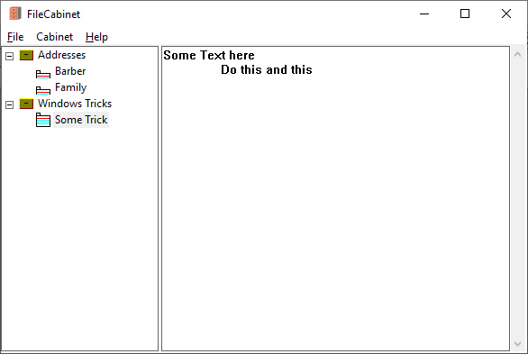

# FileCabinet

This is a simple program for saving every days stuff on register cards (or how they are named). The idea raised from the old Windows XP / 3.11 Cardfile program.

It is based on the [tinyxml library](http://www.grinninglizard.com/tinyxml/).

File cabinet is free to use.
It should be copied into a folder, in which you have writing rights. 

The program uses "Drawers" and in a "Drawer" are the cards
Click "Cabinet" menu and select "Add Drawer" to add a new Drawer.
Click "Cabinet" menu and select "Add Card" to add a new card to the currect drawer.

At first starts, the FileCabinet asks you to create a drawer. Do so, then you can start adding cards to the drawer.

The program is written with Visual Studio 2015 C++. It is plain win32 programming, so not MFC or similar is necessary.

It is the first check in, so the code is not very clean.
